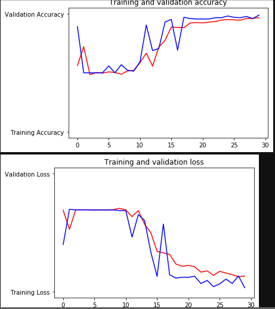

# FACE MASK DETECTION

In this project i tried to Detect Face Mask using CNN and OpenCV.

At First i built the model with CNN with two CONV2d layers followed by MaxPool Layers and using Dropout and Dense , i got around 97% train accuracy and 98% Test Accuracy.

## Running the App

To run the app, use the **face. py** script. In this script i used pretrained model which i built in **training_model.py**

## To train with your own datasets:

- Use data_generator.py . Use your own folder location
- Then Train the model with your own datasets with **training_model.py**
- Then use **face. py** to detection masked face or without mask face

I've used datasets Provided by [NVIDIA](https://developer.nvidia.com/blog/implementing-a-real-time-ai-based-face-mask-detector-application-for-covid-19/).

HAPPY CODING !! 
